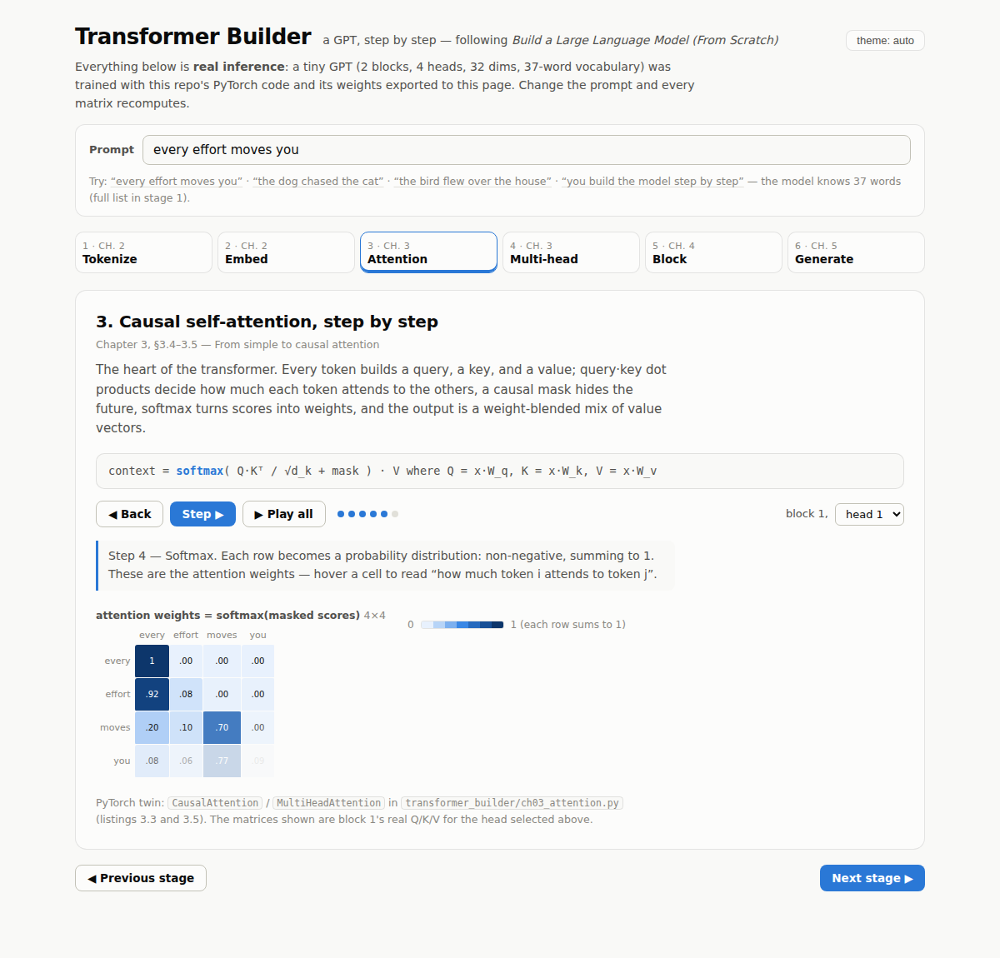

# Transformer Builder

A GPT built step by step, following Sebastian Raschka's **_Build a Large Language Model (From Scratch)_** — with an interactive, animated visualization of every stage.



The project has two halves that share one model:

1. **`transformer_builder/`** — a clean PyTorch implementation, one module per chapter of the book.
2. **`docs/`** — a zero-dependency interactive web app. A tiny GPT (2 blocks, 4 heads, 32 dims, 37-word vocabulary) is trained with the PyTorch code and its weights exported to the page, so **every matrix, attention weight, and probability you see is real inference**, recomputed live as you type.

## The interactive app

Open `docs/index.html` in a browser (no build step, no server needed), or serve `docs/` with GitHub Pages. Six animated stages mirror the book:

| Stage | What it shows | Book |
|---|---|---|
| 1 · Tokenize | text → token IDs, `<\|unk\|>` fallback, the full vocabulary | Ch. 2 §2.2–2.6 |
| 2 · Embed | token embedding + positional embedding = input vector | Ch. 2 §2.7–2.8 |
| 3 · Attention | Q/K/V projection → scores → causal mask → softmax → context, as a step-through player with attention arcs | Ch. 3 §3.4–3.5 |
| 4 · Multi-head | four heads attending differently, concat + output projection | Ch. 3 §3.6 |
| 5 · Block | animated data flow through LayerNorm → MHA → shortcut → FFN → shortcut | Ch. 4 §4.5–4.6 |
| 6 · Generate | autoregressive sampling with live temperature and top-k controls | Ch. 5 §5.1, §5.3 |

Type any prompt from the toy vocabulary (stage 1 lists it) and watch the whole pipeline recompute.

## The PyTorch code

| Module | Contents | Book |
|---|---|---|
| `ch02_data.py` | `SimpleTokenizerV1/V2`, `GPTDatasetV1`, `create_dataloader_v1` | Ch. 2 |
| `ch03_attention.py` | `SelfAttentionV1/V2`, `CausalAttention`, `MultiHeadAttention` | Ch. 3 |
| `ch04_gpt.py` | `LayerNorm`, `GELU`, `FeedForward`, `TransformerBlock`, `GPTModel`, `generate_text_simple` | Ch. 4 |
| `ch05_train.py` | loss helpers, `train_model_simple`, `generate` (temperature + top-k) | Ch. 5 |

### Setup

```bash
pip install -e ".[dev]"
pytest                                # sanity tests for every chapter
```

### Train the GPT-2-sized model on "The Verdict" (chapter 5)

```bash
python scripts/pretrain_demo.py --epochs 10
```

### Retrain and re-export the web app's toy model

```bash
python scripts/export_toy_model.py    # trains + writes docs/js/weights.js
node scripts/verify_js_model.mjs      # checks JS inference matches PyTorch
```

The verify script runs the browser-side forward pass in Node and compares its logits against reference logits baked in at export time (they agree to ~1e-4, the weight-rounding tolerance).

## Layout

```
transformer_builder/   PyTorch package (one module per chapter)
tests/                 pytest suite
scripts/               pretraining demo, toy-model export, JS verification
docs/                  the interactive app (GitHub Pages-ready)
```
